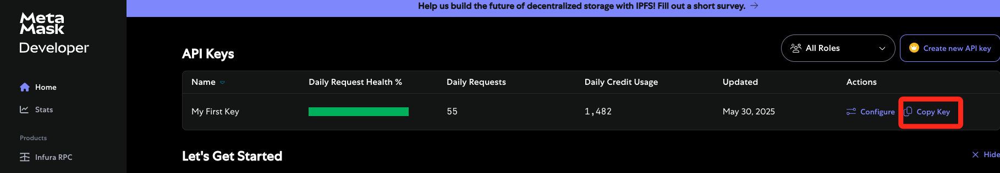

# Web3

express + ethers + solidity

# Start

```bash
pnpm start
```

# API Key

You need an API key: https://developer.metamask.io/



# Set your env

.env

```bash
INFURA_URL=https://mainnet.infura.io/v3/your-api-key
```
